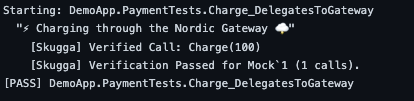

# Prova 🇸🇪


> [!IMPORTANT]
> **Experimental Research Project**: Prova is a standalone reference implementation created for research purposes to explore Native AOT testing patterns. It is **not** an official Microsoft product, nor is it an implementation of the Microsoft Testing Platform (MTP). It is a purely community-driven project.

**Prova** is a next-generation testing framework for .NET, built for **Speed**, **Native AOT**, and **Developer Experience**. 

It eliminates reflection overhead by leveraging Roslyn Source Generators to discover and run tests at compile time, enabling true zero-overhead startup and seamless AOT and trimming support.

## ✨ Features

- **⚡ Zero Reflection / Native AOT**: Fully compatible with `PublishAot`. No runtime discovery cost.
- **🏃 True Parallelism**: Test Classes run concurrently by default (`Task.WhenAll`), maximizing CPU usage.
- **🧙‍♂️ Magic Documentation**: Your `/// <summary>` test comments are automatically extracted and displayed in the runner output.
- **🎯 Focus Mode**: Use `[Focus]` to run *only* the tests you're debugging (compile-time filtering).
- **🛡️ Flake Free**: Use `[Retry(3)]` to automatically retry flaky tests.
- **🔗 Smart Verify (Nordic Suite)**: Automated integration with [Skugga](https://github.com/Digvijay/Skugga). No more manual `.VerifyAll()` calls. [Learn more](docs/SKUGGA_INTEGRATION.md).



- **📦 xUnit Parity**:
  - `[Fact]`, `[Theory]`, `[InlineData]`, `[MemberData]`
  - `IClassFixture<T>` (Singleton Fixtures)
  - `IAsyncLifetime` (Async Setup/Teardown)
  - `[Trait]` categories & filtering
  - Full `Assert` suite (`Equal`, `Throws`, `Contains`, `Single`, etc.)

## 🚀 Quick Start

1. **Install Prova**:
   ```bash
   dotnet add package Prova
   ```

   > **Note**: If manually editing your `.csproj`, ensure the generator reference includes `OutputItemType="Analyzer"`:
   > ```xml
   > <ProjectReference Include="Prova.Generators" OutputItemType="Analyzer" ReferenceOutputAssembly="false" />
   > ```

2. **Write a Test**:
   ```csharp
   using Prova;

   public class CalculatorTests
   {
       [Fact]
       public void Add_ReturnsSum()
       {
           Assert.Equal(4, 2 + 2);
       }

       /// <summary>
       /// Simple division test ➗
       /// </summary>
       [Theory]
       [InlineData(10, 2, 5)]
       public void Divide_ReturnsQuotient(int a, int b, int expected)
       {
           Assert.Equal(expected, a / b);
       }
   }
   ```

3. **Run**:
   ```bash
   dotnet run
   ```

   > **Why `dotnet run`?**
   > Prova is an executable Console Application, not a class library.
   > - **Native AOT**: `dotnet test` relies on Reflection and dynamic loading, which prohibits AOT.
   > - **Speed**: By compiling as an App, we control the entry point (`Main`), allowing instant startup without VSTest overhead.
   > - **Debug**: Debugging is as simple as hitting F5 on your console app project.

## 🛠️ Developer Experience

### Focus Mode
Working on a specific test? Don't run the whole suite. Just add `[Focus]`.

```csharp
[Fact]
[Focus] // <--- Only this test will run!
public void MyNewFeature() { ... }
```

> **Why `[Focus]`?**
> - **Zero Overhead**: Unlike runtime filtering, `Prova` *only generates code* for focused tests. Skipped tests aren't even allocated.
> - **Convenience**: No more complex CLI args like `dotnet test --filter "FullyQualifiedName~MyTest"`. Just tag and run.

### Retry Flaky Tests
Have a test that fails sporadically due to network blips?

```csharp
[Fact]
[Retry(3)] // <--- Retries up to 3 times before failing
public void NetworkTest() { ... }
```

## 🤝 Contributing

We love contributions! Please read our [CONTRIBUTING.md](CONTRIBUTING.md) to get started.

## 📄 License

Prova is fully open source and licensed under [MIT](LICENSE).
