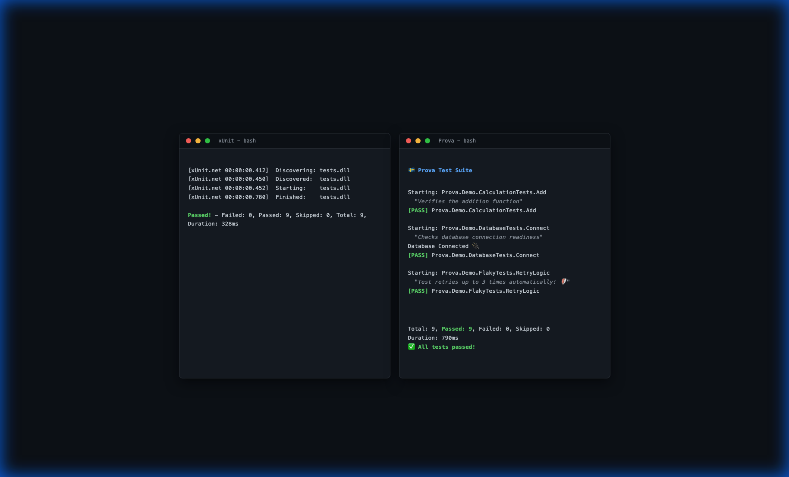

# Prova 🇸🇪


> [!NOTE]
> **Research Project**: Prova is a reference implementation for Native AOT testing patterns. It is community-driven and not an official Microsoft product.

**Prova** is a next-generation testing framework for .NET, built for **Speed**, **Native AOT**, and **Developer Experience**. 

Documentation IS the test output.



## ⚔️ The Kill Sheet

Why switch? Prova gives you the modern benefits of TUnit without the learning curve of a new syntax.

| Feature | xUnit v2/v3 | TUnit | Prova |
| :--- | :---: | :---: | :---: |
| **Runtime** | Reflection (Slow) | AOT Optimized | **Native AOT (Instant)** |
| **Syntax** | Standard (`[Fact]`) | New Fluent API | **Standard (`[Fact]`)** |
| **Discovery** | Runtime Scan | Source Gen | **Source Gen** |
| **Parallelism** | Assemblly Level | Class Level | **Class Level (Default)** |
| **Migration Cost** | - | High (Rewrite) | **Zero (Copy-Paste)** |
| **User Experience** | Plain Text | Modern | **Rich + Magic Docs** |

## ✨ Features

- **⚡ Zero Reflection / Native AOT**: Fully compatible with `PublishAot`. No runtime discovery cost. Start time: **0ms**.
- **🏃 True Parallelism**: Test Classes run concurrently by default (`Task.WhenAll`), maximizing CPU usage.
- **🔌 MTP Ready**: Fully supports the **Microsoft Testing Platform**. Works with `dotnet test` and TRX reporting.
- **🧙‍♂️ Magic Documentation**: Your `/// <summary>` test comments are automatically extracted and displayed in the runner output.
- **📦 xUnit Parity**: Don't rewrite your tests. Just change the runner.
  - `[Fact]`, `[Theory]`, `[InlineData]`, `[MemberData]`
  - `IClassFixture<T>` (Isolated Fixtures)
  - `IAsyncLifetime` (Async Setup/Teardown)
  - `[Trait]` categories & filtering
  - Full `Assert` suite (`Equal`, `Throws`, `Contains`, `Single`, etc.)

## 🛡️ The Nordic Suite

Prova is part of the **Nordic Suite** of developer tools. It is designed to work perfectly with **[Skugga](https://github.com/Digvijay/Skugga)**, our AOT-native mocking library.

> [!TIP]
> **Integration Magic**: Prova automatically detects Skugga mocks and calls `.VerifyAll()` for you at the end of every test. No more forgotten verifications!

[Learn more about Skugga Integration](docs/SKUGGA_INTEGRATION.md).

## 🚀 Quick Start

1. **Install Prova**:
   ```bash
   dotnet add package Prova
   ```

2. **Write a Test**:
   ```csharp
   using Prova;

   public class CalculatorTests
   {
       [Fact]
       public void Add_ReturnsSum()
       {
           Assert.Equal(4, 2 + 2);
       }

       /// <summary>
       /// Simple division test ➗
       /// </summary>
       [Theory]
       [InlineData(10, 2, 5)]
       public void Divide_ReturnsQuotient(int a, int b, int expected)
       {
           Assert.Equal(expected, a / b);
       }
   }
   ```

3. **Run**:
   
   **Option A: Direct Execution (Fastest / Recommended)**
   ```bash
   dotnet run
   ```

   **Option B: `dotnet test` (CI/CD / MTP)**
   Prova fully supports the **Microsoft Testing Platform**. To use `dotnet test`, add a `global.json` to your solution root:
   ```json
   {
       "test": {
           "runner": "Microsoft.Testing.Platform"
       }
   }
   ```
   Then run:
   ```bash
   dotnet test --project MyTestProject.csproj
   ```

## 🔌 Microsoft Testing Platform (MTP) Support

Prova is a first-class citizen in the modern .NET testing ecosystem. By integrating the **Hybrid MTP Adapter**, Prova provides:
- **Full `dotnet test` integration** via the `Microsoft.Testing.Platform` runner.
- **TRX Report generation** for Azure DevOps, GitHub Actions, and Jenkins.
- **Code Coverage**: Built-in support for `--coverage` to generate `coverage.xml` or Cobertura reports.
- **In-process test execution** with zero reflection overhead.

Check out the [MTP Sample](samples/Prova.MtpSample) for a complete example.

### 📊 Code Coverage

To generate code coverage, use the `--coverage` flag:

```bash
# Via dotnet run
dotnet run -- --coverage --coverage-output-format cobertura

# Via dotnet test
dotnet test -- --coverage --coverage-output-format cobertura
```

> [!NOTE]
> **AOT Coverage**: Code coverage currently works primarily in JIT mode. Support for Native AOT coverage is an evolving area in the .NET ecosystem.


Prova tests compile into a **stand-alone Console Application**, not a Class Library.

- **0ms Startup**: We control the entry point (`Main`). No VSTest adapter overhead. 
- **MTP via `dotnet run`**: Get the full Microsoft Testing Platform experience (TRX, etc.) without leaving the fast `dotnet run` inner loop.
- **Debuggable**: Just hit **F5**. It's just a console app!
- **Cloud-Ready**: Compile to a single Native AOT binary and dropship it to any container.

## 🛠️ Developer Experience

### Focus Mode
Working on a specific test? Don't run the whole suite. Just add `[Focus]`.

```csharp
[Fact]
[Focus] // <--- Only this test will run!
public void MyNewFeature() { ... }
```

> **Why `[Focus]`?**
> - **Zero Overhead**: Unlike runtime filtering, `Prova` *only generates code* for focused tests. Skipped tests aren't even allocated.
> - **Convenience**: No more complex CLI args like `dotnet test --filter "FullyQualifiedName~MyTest"`. Just tag and run.

### Retry Flaky Tests
Have a test that fails sporadically?

```csharp
[Fact]
[Retry(3)] // <--- Retries up to 3 times before failing
public void NetworkTest() { ... }
```

## 🤝 Contributing

We love contributions! Please read our [CONTRIBUTING.md](CONTRIBUTING.md) to get started.

## 📄 License

Prova is fully open source and licensed under [MIT](LICENSE).
