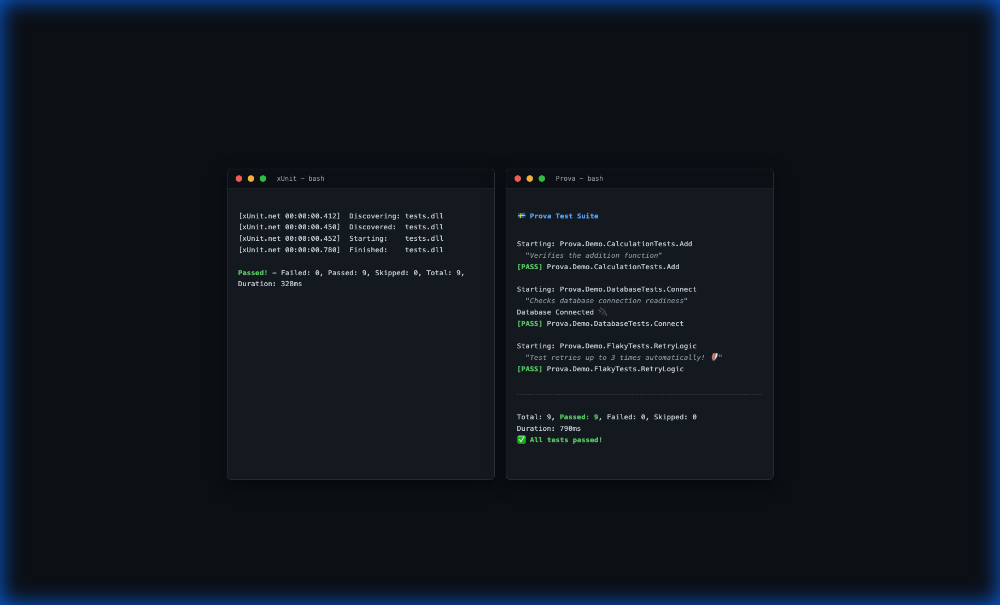

# Prova 🇸🇪

[](https://github.com/Digvijay/Prova/actions)
[](LICENSE)
[](https://www.nuget.org/packages/Prova)
[](https://prova.digvijay.dev)

**Prova** is a high-performance, Native AOT-compatible test runner for .NET. Use the xUnit syntax you already know, but with zero runtime reflection and instant startup.

📖 **[Read the full documentation →](https://prova.digvijay.dev)**

## Why Prova?

### 1. Zero Migration Cost
Your tests remain exactly the same. Prova supports standard xUnit attributes (`[Fact]`, `[Theory]`, `[InlineData]`, `Assert`). You only change the runner.

### 2. Native Performance
Tests are discovered at compile-time using Source Generators and can be compiled to Native AOT. This eliminates runtime discovery costs and enables instant startup, making it ideal for high-frequency "inner loop" development or containerized CI environments.

### 3. Safe Parallelism
Tests run in parallel by default (`Task.WhenAll`), utilizing all available cores.

---

## Quick Start

### 1. Install
```bash
dotnet add package Prova
```

### 2. Write Tests (Standard xUnit Syntax)
```csharp
using Prova;

public class CalculatorTests
{
    [Fact]
    public void Add_ReturnsSum()
    {
        Assert.Equal(4, 2 + 2);
    }

    [Theory]
    [InlineData(10, 2, 5)]
    [InlineData(20, 4, 5)]
    public void Divide_ReturnsQuotient(int a, int b, int expected)
    {
        Assert.Equal(expected, a / b);
    }
}
```

### 3. Run
```bash
dotnet run
```

---

## Microsoft Testing Platform (MTP) Support

Prova integrates with the [Microsoft Testing Platform](https://github.com/microsoft/testfx). This enables support for `dotnet test`, TRX reporting, and code coverage without sacrificing AOT compatibility.

```bash
dotnet test --coverage --report-trx
```

---

## Integration Packages

| Package | Description | NuGet |
|---------|------------|-------|
| [`Prova`](https://www.nuget.org/packages/Prova) | Core framework | [](https://www.nuget.org/packages/Prova) |
| [`Prova.AspNetCore`](https://www.nuget.org/packages/Prova.AspNetCore) | ASP.NET Core integration | [](https://www.nuget.org/packages/Prova.AspNetCore) |
| [`Prova.Playwright`](https://www.nuget.org/packages/Prova.Playwright) | Playwright browser testing | [](https://www.nuget.org/packages/Prova.Playwright) |
| [`Prova.Testcontainers`](https://www.nuget.org/packages/Prova.Testcontainers) | Docker container testing | [](https://www.nuget.org/packages/Prova.Testcontainers) |
| [`Prova.FsCheck`](https://www.nuget.org/packages/Prova.FsCheck) | Property-based testing (FsCheck) | [](https://www.nuget.org/packages/Prova.FsCheck) |

---

## Advanced Features

While Prova is a drop-in replacement, it adds enterprise-grade features for strictly governed codebases.

### Explicit Concurrency
Prevent thread pool starvation in massive test suites by bounding parallelism.

```csharp
[Parallel(max: 4)] // Limits concurrency for this class
public class DatabaseTests { ... }
```

### Allocation Governance
Enforce zero-allocation policies or strict memory budgets for critical paths.

```csharp
[Fact]
[MaxAlloc(0)] // Fails if the test allocates any memory on the heap
public void HotPath_ShouldNotAllocate() { ... }
```

### Flakiness Management
```csharp
[Fact]
[Retry(3)] // Automatically retry flaky network tests
public void IntegrationTest() { ... }
```

### Focused Execution
Run only the specific test you are debugging (similar to `.only` in Jest).

```csharp
[Fact]
[Focus] // Prova will ONLY generate and run this test
public void DebuggingThisRightNow() { ... }
```

---

## Contributing

We welcome issues and pull requests. Please see [CONTRIBUTING.md](CONTRIBUTING.md) for details.

## See it in Action

Prova produces clean, hierarchical output that is easy to parse visually.



## License

MIT
